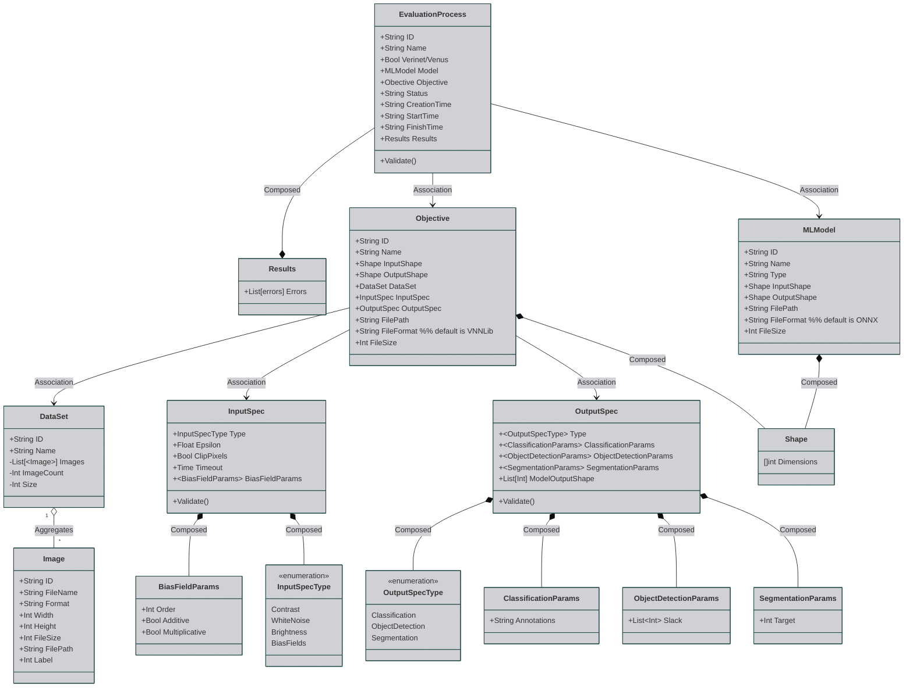

- Validate dataset input & output matches input range of Models
- Validate operations within model are supported by Verninet/Venus
- early validation of model to vnnlib via parsing 

- model/(vnnlib/dataset) validator - input spec, output spec, dataset input shapes, model, (vapp)

'darkMode': 'true'

